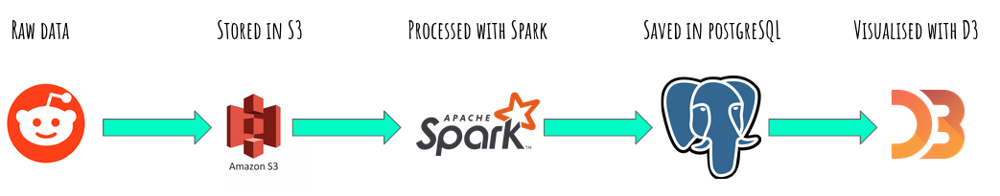

# Subreddits graph
Platform for showing connections between subreddits

**Programming Languages**: Python, SQL, shell scripting

**Technologies**: Spark, Posgresql, D3

**AWS Services**: S3, EC2

[Slides](https://docs.google.com/presentation/d/1DUUVhePwMpMyix23kqSvqgbo3jmJvcReRSmk2oquXDE/edit#slide=id.g96abc2b0f8_0_63)    
## Introduction
Reddit, the self-proclaimed "front page of the internet", is the sixth most popular website in the US, and has on average 21 billion screen views per month. This is prime real estate for advertising. Adverstisers want to maximize the reach of their advertisements, either by advertising early on posts that are engaging, or commenting on these posts early to maximize user interaction.

So, it is a great resource for making platform to show connections between many popular topics. This will help for marketing targeting the audience for new product.
## Quickstart Guide
### Postgresql
1. Install Postgresql and setup the database for remote access.
2. Create database 'subreddits' and then create the table 'subreddits_l'
### Spark Cluster Setup
0. Setup keyless ssh between the master and worker nodes.
1. Install prerequisites and Spark binaries on the master and worker nodes
2. Setup the master node according to this [article](https://blog.insightdatascience.com/simply-install-spark-cluster-mode-341843a52b88).
## Project Details

![UI result] (docs/images/UI.png)

Big Data challenge 
#    Improve formula
#    Indexing

### The Data
The data is the daily post data for December 2019 downloaded from [pushshift](https://files.pushshift.io/reddit/daily/). The data is stored in JSON format. The files are stored in an AWS S3 bucket.

